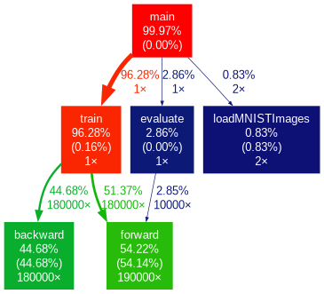

# MNIST Classifier - V1 (Baseline)

This is the **V1** branch of the MNIST Classifier project, which implements a **sequential CPU-based** neural network for classifying the MNIST dataset. This version serves as the **baseline implementation** for the project, from which we will benchmark and measure performance improvements in later versions.

## Key Features of V1

- **Sequential CPU-based Neural Network**: This version runs entirely on the CPU, utilizing a simple feedforward neural network with backpropagation.
- **Dataset**: The model is trained on the MNIST dataset, consisting of handwritten digits.
- **Loss Function**: Cross-entropy loss is used for evaluating performance.
- **Optimizer**: Gradient Descent is used to update the weights.

## Getting Started

Follow the steps below to set up the MNIST dataset and start training the model on your system.

### 1. Dataset

Download the dataset from [here](https://www.kaggle.com/datasets/hojjatk/mnist-dataset?select=t10k-images.idx3-ubyte) and extract it.

### 2. Directory Setup

Create a directory named `data` at the root of the directory. Place the extracted files inside this directory so that the structure is as follows:

```bash
cuda-mnist-classifier/
  └── data/
      ├── t10k-images.idx3-ubyte
      ├── t10k-labels.idx1-ubyte
      ├── train-images.idx3-ubyte
      └── train-labels.idx1-ubyte
```

## How to Run

### 1. Clone the repository

```bash
git clone https://github.com/arqamz/cuda-mnist-classifier.git
cd mnist-classifier
```

### 2. Build the project

```bash
make build
```

### 3. Run the program

```bash
make run
```

This will train a model built on the CPU-based neural network and evaluate it against the test data.

## Profiling

I used gprof to measure the execution time of the training process.

Here is the profiling information for **V1**, the sequential CPU version:

- **Epoch 1** - Loss: 0.2678 - Train Accuracy: 91.88% - Time: 26.168s
- **Epoch 2** - Loss: 0.1067 - Train Accuracy: 96.83% - Time: 26.168s
- **Epoch 3** - Loss: 0.0733 - Train Accuracy: 97.88% - Time: 27.304s

### Total training time: 79.643s

### Test Accuracy: 96.53%

Machine used for the profiling:

- **Processor**: 12th Gen Intel i7-12700H (20) @ 2.688GHz  
- **GPU**: GeForce RTX™ 3050 Laptop

### Profiling Graph



## Next Steps

This version establishes the baseline performance, and future versions will introduce cuda based GPU acceleration and optimizations to significantly reduce training time and improve performance. This V1 branch will be used as a reference to benchmark the progress made in later versions:

- **V2**: A naive GPU implementation for acceleration.
- **V3**: Optimizations for GPU, including memory and communication optimizations.
- **V4**: Utilization of Tensor Cores for the highest performance on supported hardware.
