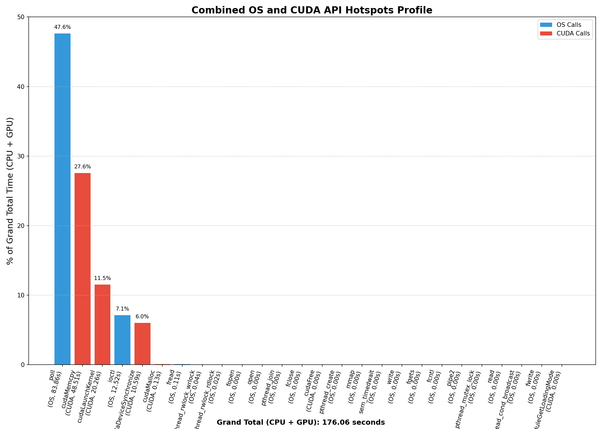

# MNIST Classifier - V2 (Naive CUDA Implementation)

This is the **V2** branch of the MNIST Classifier project, which introduces a **naive CUDA-based** implementation to accelerate the training of a neural network on the MNIST dataset. This version aims to provide a basic GPU implementation, using CUDA for essential operations like activation functions and softmax. However, it is still a rudimentary implementation and does not achieve significant speedups compared to the CPU-based version, as further optimizations are still needed.

The **V1** branch, which implements the sequential CPU-based neural network, serves as a baseline for performance comparisons and will continue to be used for benchmarking the improvements in the later versions.

## Key Features of V2

- **Naive CUDA-based Neural Network**: This version leverages the GPU for basic neural network operations, such as forward propagation, backpropagation, ReLU activation, and softmax. However, it still needs optimization to fully utilize the GPU's potential.
- **Dataset**: The model is trained on the MNIST dataset, consisting of handwritten digits.
- **Loss Function**: Cross-entropy loss is used for evaluating performance.
- **Optimizer**: Gradient Descent is used to update the weights.

## Getting Started

Follow the steps below to set up the MNIST dataset and start training the model on your system.

### 1. Dataset

Download the dataset from [here](https://www.kaggle.com/datasets/hojjatk/mnist-dataset) and extract it.

### 2. Directory Setup

Create a directory named **data** at the root of the directory. Place the extracted files inside this directory so that the structure is as follows:

```bash
cuda-mnist-classifier/
  └── data/
      ├── t10k-images.idx3-ubyte
      ├── t10k-labels.idx1-ubyte
      ├── train-images.idx3-ubyte
      └── train-labels.idx1-ubyte
```

## How to Run

### 1. Clone the repository

```bash
git clone https://github.com/arqamz/cuda-mnist-classifier.git
cd cuda-mnist-classifier
```

### 2. Build the project

```bash
make build
```

### 3. Run the program

```bash
make run
```

This will train the model using the GPU-based implementation and evaluate it against the test data.

## Profiling

For the **V2** CUDA implementation, I used **nsys** to profile the execution time of various CUDA API calls. Below are the profiling results for the key operations involved:

### **OS Runtime Summary (osrt_sum)**

| Time (%) | Total Time (ns) | Num Calls | Avg (ns) | Med (ns) | Min (ns) | Max (ns) | StdDev (ns) | Name                   |
|----------|------------------|-----------|----------|----------|----------|----------|-------------|------------------------|
| 86.8     | 83863587953      | 841       | 99718891.7 | 100165104.0 | 1861     | 100587039 | 6295566.0  | poll                   |
| 13.0     | 12517195119      | 3529869   | 3546.1    | 3060.0   | 1004     | 80947660  | 44334.1    | ioctl                  |
| 0.1      | 113602958        | 10096     | 11252.3   | 1576.0   | 1000     | 14954506  | 150879.6   | fread                  |
| 0.0      | 44327946         | 230       | 192730.2  | 127102.0 | 29593    | 523269    | 138338.7   | pthread_rwlock_wrlock  |
| 0.0      | 19482455         | 221       | 88155.9   | 85442.0  | 1415     | 293876    | 46387.7    | pthread_rwlock_rdlock  |
| 0.0      | 4039240          | 41        | 98518.0   | 5656.0   | 1056     | 2152519   | 375794.1   | fopen                  |

### **CUDA API Summary (cuda_api_sum)**

| Time (%) | Total Time (ns) | Num Calls | Avg (ns)   | Med (ns)  | Min (ns) | Max (ns)  | StdDev (ns) | Name                   |
|----------|------------------|-----------|------------|-----------|----------|-----------|-------------|------------------------|
| 61.0     | 48508608231      | 940004    | 51604.7    | 34100.5   | 4974     | 3073556   | 43129.4     | cudaMemcpy             |
| 25.5     | 20260295756      | 2210000   | 9167.6     | 7662.0    | 3464     | 3534451   | 8833.6      | cudaLaunchKernel       |
| 13.3     | 10588067949      | 370000    | 28616.4    | 21906.0   | 1080     | 2525434   | 20982.0     | cudaDeviceSynchronize  |
| 0.20     | 134640993        | 11        | 12240090.3 | 2939.0    | 2066     | 134148210 | 40432571.5  | cudaMalloc             |

Here is the profiling information for **V2**, the naive GPU version:

- **Epoch 1** - Avg Loss: 0.2333 - Train Accuracy: 93.05% - Time: 24.422s
- **Epoch 2** - Avg Loss: 0.0997 - Train Accuracy: 97.06% - Time: 29.251s
- **Epoch 3** - Avg Loss: 0.0687 - Train Accuracy: 97.97% - Time: 27.238s

### Total training time: 80.910s

### Test Accuracy: 97.19%

Machine used for the profiling:

- **Processor**: 12th Gen Intel i7-12700H (20) @ 2.688GHz  
- **GPU**: GeForce RTX™ 3050 Laptop

### Profiling Graph



### Performance Notes

While the CUDA-based implementation (V2) introduces GPU acceleration for key operations like ReLU activation and softmax, there is **no significant speedup** observed at this stage. The current implementation is still rudimentary and requires further optimization. The CUDA calls made in the code are a first step towards GPU-based processing but need refinement in terms of memory management and kernel efficiency.

## Next Steps

The V2 implementation serves as a starting point for utilizing the GPU. Future versions will introduce optimizations to improve the performance significantly, such as:

- **V3**: Optimizations for GPU, including memory and communication optimizations.
- **V4**: Utilization of Tensor Cores for the highest performance on supported hardware.

The V1 branch remains as a reference for comparison with the CPU-based version.
